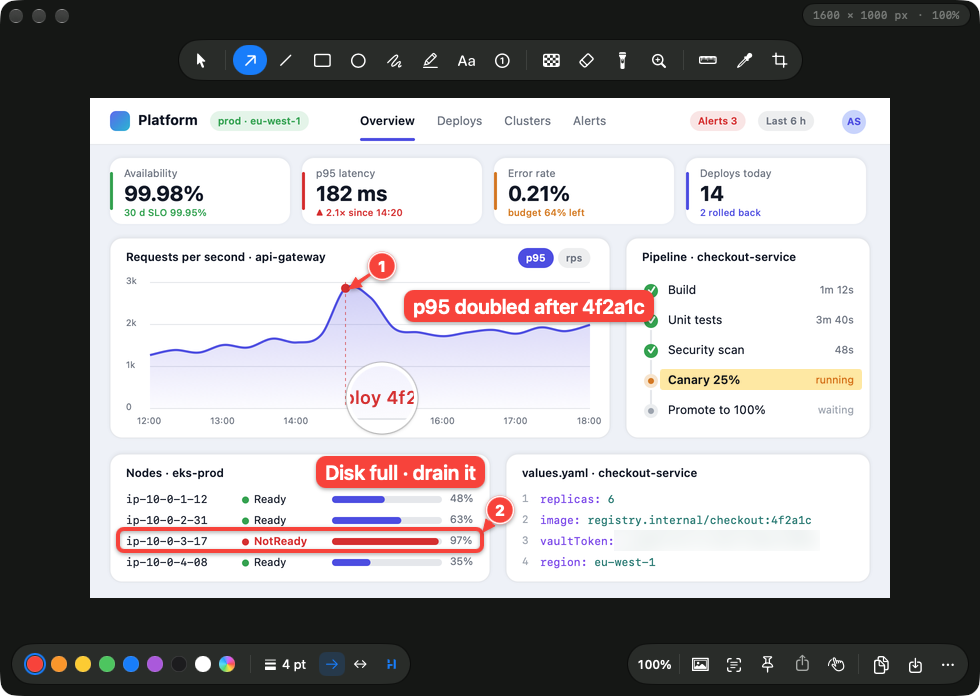
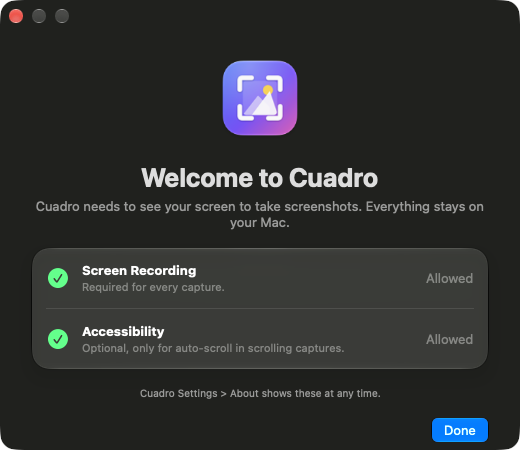

# Cuadro

Free, native screenshot tool for macOS 26 and later, with Shottr's feature set and a Liquid Glass interface. It lives in the menu bar, has no account, no upload and no paywall, and keeps everything on your Mac.



## Features

- **Capture:** area (frozen screen with magnifier and pixel grid), window (with or without shadow, transparent corners), active window, full screen, repeat last area, delayed (3, 5 or 10 s), scrolling capture with live stitching and optional auto-scroll, pin an area directly to the screen. Hold Control to copy a screenshot without opening anything.
- **Screen recording:** an area, a window or a whole display to MP4, with or without the microphone. Adjust the area before recording starts and move it while it records; the movie pans smoothly after it. The pointer, highlighted clicks and system audio are options.
- **Screen tools:** color picker (HEX, RGB, HSL or OKLCH, plus WCAG contrast against a reference color), screen ruler that snaps to edges, text recognition (OCR) with QR and barcode reading.
- **Editor:** arrow (straight, curved, double), line, rectangle, ellipse, pen, highlighter, text (plain, outlined, label), step counter, pixelate, blur, smart erase, spotlight, magnifier, measurement, crop with aspect presets and auto-trim, pasted image overlays, backdrop (gradient, solid or transparent, padding, corners, shadow, aspect ratio), resize, undo and redo.
- **Output:** clipboard, quick save with file name templates, Save As (PNG, JPEG, HEIC), drag and drop, share sheet, print, open in Preview, pin as a floating window, optional 1x downscale for Retina captures, recent captures history.
- **Updates:** in place with [Sparkle](https://sparkle-project.org): **Check for Updates…** in the menu bar menu, and a daily check you can turn off in Settings > General.

## Requirements

- macOS 26 or later.
- Xcode with Swift 6.2 or later (developed with Xcode 27 and Swift 6.4).
- An "Apple Development" signing identity is recommended (see [Signing](#signing)).
- For `make dist`: [dmgbuild](https://github.com/dmgbuild/dmgbuild), `pipx install dmgbuild` (CI's pinned versions are in `.github/dmg-requirements.txt`).

## Build and run

```sh
make app        # release build, assembles and signs build/Cuadro.app
make run        # make app, quit a running copy, open the new one
make install    # copy to ~/Applications/Cuadro.app
make test       # unit tests (Swift Testing)
make dist       # zip, dmg and SHA256SUMS of build/Cuadro.app in build/dist
make appcast    # sign the zip and write build/dist/appcast.xml, the update feed
make clean      # remove .build and build
```

Install to `~/Applications` before turning on **Launch at login**: the login item points at the app's current location.

### Signing

`make app` signs with the first "Apple Development" identity in your keychain, so the code signature stays stable across rebuilds and updates, and Screen Recording and Accessibility stay allowed. Without one it falls back to ad-hoc signing: to macOS every build, and every update, is a new app, so it asks for both permissions again. Override with `make app SIGN_IDENTITY=-` (ad-hoc) or any identity hash from `security find-identity -v -p codesigning`.

A free Apple ID is enough for an Apple Development identity: Xcode > Settings > Accounts, add the Apple ID, then Manage Certificates > + > Apple Development.

Every build carries `com.apple.security.device.audio-input` (`Resources/Cuadro.entitlements`): without it the hardened runtime refuses the microphone, and macOS never even asks. Ad-hoc builds sign with `Resources/AdHoc.entitlements` instead, which adds `com.apple.security.cs.disable-library-validation`: an ad-hoc signature has no team ID, so the hardened runtime would refuse to load the embedded Sparkle.framework. Builds signed with a real identity do not get that one.

## Permissions

| Permission | Needed for | Where |
| --- | --- | --- |
| Screen Recording | Every capture | System Settings > Privacy & Security > Screen & System Audio Recording |
| Accessibility | Auto-scroll in scrolling capture only | System Settings > Privacy & Security > Accessibility |
| Microphone | Only **Record Screen with Microphone**, or the microphone switch next to **Record** | System Settings > Privacy & Security > Microphone |

Nothing else is needed: global shortcuts are Carbon hot keys, which work without Input Monitoring. System audio in recordings comes with Screen Recording.



The first launch opens a welcome window that shows both permissions with their live state and an **Allow…** button for each missing one. Later launches open it again only while Screen Recording is missing; until then the menu bar menu starts with **Allow Screen Recording…**, and a capture opens the window instead of failing. Accessibility is optional and also requested the first time you press Auto-Scroll. Settings > About shows both at any time.

macOS applies a Screen Recording grant only to a new process: after switching it on, choose **Quit & Reopen** in System Settings or click **Relaunch Cuadro**.

After an update of an ad-hoc signed copy, System Settings still shows Cuadro switched on, but the entry belongs to the old signature and macOS ignores it for the new copy. **Allow…** handles this: its first press per launch clears Cuadro's own entry (`tccutil reset ScreenCapture io.github.mrcat71.cuadro`, likewise `Accessibility`) and asks afresh, so switching Cuadro on again is enough. A stable signature (see [Signing](#signing)) avoids the round trip.

## Updates

Cuadro checks `appcast.xml` on the latest GitHub release (`SUFeedURL` in `Resources/Info.plist`) once a day and on **Check for Updates…**. Sparkle downloads the zip, rejects it unless its EdDSA signature matches `SUPublicEDKey` (checked before extraction), replaces the app and relaunches it. Updates installed this way are not quarantined, so they need no Open Anyway. Whether permissions survive an update depends on the signature (see [Signing](#signing)).

The feed and the downloads must be public, so in-app updates work once the repository is public. 0.1.1 is the first version with Sparkle: a copy of 0.1.0 has to be replaced by hand once.

The signing key was made with Sparkle's `generate_keys` and lives in the login keychain of the Mac that made it (account `ed25519`). Keep a copy in a password manager: without it no installed copy accepts another update. The release workflow reads it from the `SPARKLE_PRIVATE_KEY` repository secret, set from the keychain with:

```sh
d=$(mktemp -d) && .build/artifacts/sparkle/Sparkle/bin/generate_keys -x "$d/key" && gh secret set SPARKLE_PRIVATE_KEY --repo mrcat71/cuadro < "$d/key"; rm -rf "$d"
```

`make appcast` refuses a feed whose signature does not match the app's `SUPublicEDKey` (`Scripts/check-appcast.swift`): `generate_appcast` only warns about a wrong key and writes the item unsigned.

## Shortcuts

Global shortcuts work in every app and are set in **Settings > Shortcuts**. Defaults match Shottr: ⇧⌘1 full screen, ⇧⌘2 area. Every other action starts unassigned and is available from the menu bar icon. macOS keeps ⇧⌘3, ⇧⌘4 and ⇧⌘5 unless you turn them off in System Settings > Keyboard > Keyboard Shortcuts > Screenshots.

**While selecting an area:** drag to select; hold Space to move the selection; Shift for a square; Option to draw from the center; click without dragging to take the window under the pointer; Space (not dragging) switches to window mode; Return takes the whole display; Tab copies the color under the pointer; arrows nudge the pointer by 1 pt (Shift: 10 pt); Esc or right-click cancels.

**Copy only:** hold Control as you finish a selection, or add Control to a capture shortcut (⌃⇧⌘2 for the default area shortcut), and the screenshot goes to the clipboard with nothing opening and nothing saved. Holding Control while picking a capture from the menu does the same.

**Screen recording:** choose **Record Screen** or **Record Screen with Microphone**, then drag an area, click a window or press Return for the whole display. The area stays up for adjusting while the rest of the display dims: drag inside it to move it, drag a handle to resize it, drag outside it for a new one, arrows nudge it (Shift: 10 pt). The bar below it shows the size, a microphone switch, **Cancel** (Esc or right-click) and **Record** (Return or either Record Screen shortcut). While recording, a red border marks the area and the bar shows the timer and **Stop**; drag the bar to move the area and the movie pans smoothly after it, within the display where the area was selected. Stop, the menu bar menu or either Record Screen shortcut ends the recording. The MP4 lands in the screenshots folder, is copied to the clipboard as a file and is shown in Finder. Settings > Capture sets the pointer, click highlighting and system audio. With system audio and the microphone the movie has two audio tracks, the microphone first, since some players only play the first one. The microphone track is AAC at the microphone's own sample rate, 96 kbps mono or 128 kbps stereo; a Bluetooth headset records at 8 to 24 kHz, where the encoder allows less, so it gets the highest bit rate the encoder accepts (64 kbps at 24 kHz mono). The capture-category log line `Microphone track: …` shows the format used. Areas larger than 4096 × 2304 pixels are encoded as HEVC, smaller ones as H.264.

**Color picker:** click copies the color in the format chosen in Settings; Shift-click sets a reference color and the loupe then shows the contrast ratio.

**Scrolling capture:** select the area, then scroll its content slowly with the trackpad or mouse wheel, or press **Auto-Scroll** in the panel beside the area, and press **Done** (Return). The panel shows the image growing. Scroll down for pages, up for chats that open at the newest message.

**Screen ruler:** hover to see the distances between edges; drag to measure a box; click or ⌘C copies the measurement; scroll changes edge sensitivity; ↑ or ↓ locks to vertical, ← or → to horizontal; Esc closes.

**Editor tools:** V select, A arrow, L line, R rectangle, O ellipse, P pen, H highlighter, T text, N step counter, B pixelate/blur, E smart erase, S spotlight, M magnifier, U ruler, I color picker, C crop.

| Editor action | Keys |
| --- | --- |
| Copy image, save, Save As, print | ⌘C, ⌘S, ⇧⌘S, ⌘P |
| Undo, redo | ⌘Z, ⇧⌘Z |
| Recognize text, pin, backdrop, resize | ⇧⌘T, ⇧⌘P, ⇧⌘B, ⌥⌘R |
| Zoom in, out, actual size, fit | ⌘=, ⌘-, ⌘0, ⌘9, or ⌘-scroll and pinch |
| Pan | Hold Space and drag |
| Paste an image as an overlay | ⌘V |
| Open a file, open the clipboard image | ⇧⌘O, ⇧⌘V |
| Delete, duplicate, nudge selected markup | Delete, ⌘D, arrows (Shift: 10 pt) |
| Step counter: place the badge, move it, re-aim the pointer | Click the target (or drag from it to where the badge goes), drag the badge, drag the pointer tip |
| Edit text, finish editing | Double-click or Return, then Esc or ⌘Return |
| Spotlight darkness | 1 to 9 with the spotlight tool or a spotlight selected |
| Apply or cancel crop | Return, Esc |
| Stamp the ruler's hover measurement | Option-click with the ruler tool |

## Settings and files

- Screenshots folder: `~/Pictures/Screenshots` by default; file names come from a template such as `Screenshot {date} at {time}` (tokens are listed in Settings > Output).
- Recent captures: `~/Library/Application Support/Cuadro/History` (30 by default, configurable or off in Settings > General).
- Preferences: the `io.github.mrcat71.cuadro` defaults domain.

## Architecture

| Target | Path | Role |
| --- | --- | --- |
| `CuadroKit` | `Sources/CuadroKit` | Pure logic with no AppKit: geometry, annotation model and hit testing, `DocumentRenderer` (CoreGraphics, CoreText, CoreImage), `ScrollStitcher`, edge finder, color formats, file name templates, key combos, OCR text assembly, recording frame geometry and smoothing, AAC settings the encoder accepts. Fully unit-tested. |
| `Cuadro` | `Sources/Cuadro` | The app: AppKit lifecycle with SwiftUI views and `defaultIsolation(MainActor)`; Sparkle (the only package dependency) for updates. |
| `cuadro-icon` | `Sources/cuadro-icon` | Draws the app icon PNG set; `make` turns it into `AppIcon.icns`. |
| `CuadroKitTests` | `Tests/CuadroKitTests` | Table-driven Swift Testing suites. |

Inside the app:

- `App/`: lifecycle, menus, `DockPresence` and `Updater` (Sparkle, with gentle reminders for a menu bar app).
- `Capture/`: `ScreenCaptureService` (ScreenCaptureKit display and window screenshots), `CaptureCoordinator` (every mode and the post-capture pipeline), `Overlay/` (frozen-screen selection, picker and ruler), `Scrolling/` (SCStream plus stitching off the main actor), `Recording/` (the adjust stage and the recording controls; an SCStream of the whole display whose frames `RecordingWriter` crops to the area and writes to MP4 with AVAssetWriter. `SCRecordingOutput` would be simpler, but it ends its movie on any change to the stream configuration, so it cannot follow a moving area).
- `Editor/`: `EditorModel` (document state as a value, undo snapshots), `Canvas/` (NSScrollView canvas drawing through `DocumentRenderer`, so the canvas and the export match), `Chrome/` (floating Liquid Glass palettes).
- `Hotkeys/` (Carbon `RegisterEventHotKey`, no Accessibility needed), `Permissions/`, `Output/`, `Pin/`, `QuickAccess/`, `OCR/` (Vision), `Settings/`, `HUD/`.

## Releases

Pushing a version tag runs [`release.yml`](.github/workflows/release.yml): tests, release build, smoke test, then a GitHub Release titled with the tag (`v0.1.1`) with `cuadro-<version>-macos-arm64.zip` (also the update archive), a `.dmg` that opens on the app and an Applications link, `SHA256SUMS` and the signed `appcast.xml`. Its notes are generated from the commits and also show in the update window. Bump `VERSION` in the `Makefile` and `CFBundleShortVersionString` in `Resources/Info.plist` for each release.

```sh
git tag -a v0.1.1 -m "Cuadro 0.1.1"
git push origin v0.1.1
```

Tags must look like `v1.2.3`, or `v1.2.3-beta.1` for a pre-release. Running the workflow by hand (Actions > release > Run workflow) builds the same files without publishing and attaches them to the run. `make app dist VERSION=1.2.3` produces them locally in `build/dist`.

The job runs on GitHub's hosted `xcode-27` macOS image because the self-hosted runners are Linux only. While the repository is private, those macOS minutes count against the account's Actions quota.

Publishing requires the `SPARKLE_PRIVATE_KEY` secret (see [Updates](#updates)); a manual run without it skips the feed. Signing depends on which of the other secrets exist:

| Secrets | Result |
| --- | --- |
| None | Ad-hoc signed. macOS blocks the first launch of a downloaded copy; allow it in System Settings > Privacy & Security > Open Anyway. Screen Recording must be granted again after every update. |
| `MACOS_CERTIFICATE_P12`, `MACOS_CERTIFICATE_PASSWORD` with your Apple Development certificate | Stable signature, so the Screen Recording grant survives updates on your Macs. Other Macs still need Open Anyway. |
| The two above with a Developer ID Application certificate, plus `NOTARY_APPLE_ID`, `NOTARY_TEAM_ID`, `NOTARY_PASSWORD` (app-specific password) | Notarized and stapled; opens normally on any Mac. Needs a paid Apple Developer Program membership. |

Moving from ad-hoc signing to a certificate is a signature change too: the update that brings it asks for Screen Recording one last time, and later ones keep it. Sparkle accepts that update because the EdDSA key stays the same; it allows changing the Apple certificate or the EdDSA key in one update, never both.

To add a certificate, export it from Keychain Access (My Certificates, right-click the certificate, Export, `.p12` with a password), then:

```sh
base64 -i Cuadro.p12 | gh secret set MACOS_CERTIFICATE_P12 --repo mrcat71/cuadro
gh secret set MACOS_CERTIFICATE_PASSWORD --repo mrcat71/cuadro
```

Renovate keeps the pinned action SHAs, Sparkle (`exact:` in `Package.swift`) and dmgbuild current (`.github/renovate.json`). It runs from the self-hosted Renovate CE in `okira-infra`, whose repository allowlist must include `mrcat71/cuadro`.

## Development checks

```sh
swift build                 # debug build, should report no warnings
swift test                  # CuadroKit unit tests
make app && codesign --verify --deep --strict build/Cuadro.app
make dist appcast           # dmg, zip and a feed signed with the keychain key
```

Logs: `/usr/bin/log show --last 10m --predicate 'subsystem == "io.github.mrcat71.cuadro"'`. Use the full path in zsh, where `log` is a shell builtin.

UI self-check: `build/Cuadro.app/Contents/MacOS/Cuadro --ui-snapshot /tmp/cuadro-ui` opens the editor, settings, onboarding, a pin, a toast, a thumbnail, a recording frame being adjusted (which dims the main screen for about two seconds), the controls of a recording and the selection overlay with a synthetic screenshot, writes a PNG per window, prints the editor's zoom (100% unless the screen is too small for the 800 × 500 pt sample) and quits. With Screen Recording allowed it captures the real windows and also records about two seconds through the Record Screen pipeline: whole-display frames that show only its editor window, with the crop panning across it as if the controls were dragged. It writes `recording.mp4`, prints its size and frame counts, and saves its first and last frames as `recording-first.png` and `recording-last.png`, which should show opposite corners of the editor. Without Screen Recording it renders the layer trees in-process, where Liquid Glass surfaces appear flat, and skips the recording. Either way it stops without writing any image when the recording controls are not above the dimmed screen, which would take their clicks; the release smoke test then fails. The README pictures in `docs/images` come from this run.

## Manual test checklist

Run these after changes to capture or the editor; they need a real screen and input.

- [ ] First launch (`defaults delete io.github.mrcat71.cuadro completedOnboardingVersion` resets it): the welcome window lists both permissions; after granting Screen Recording and relaunching it shows both states, and Done keeps it closed on later launches.
- [ ] ⇧⌘2: drag an area, the editor opens and the image is on the clipboard; Esc cancels and focus returns to the previous app.
- [ ] A capture smaller than the screen opens at 100% and stays fitted while the window is resized, until you zoom.
- [ ] Area mode: Space toggles window mode; clicking a window captures it with a shadow and transparent corners.
- [ ] ⇧⌘1 captures the display under the pointer; Repeat Last Area reproduces the previous rectangle.
- [ ] Multiple displays (and a non-Retina display if available): overlay on every screen, correct crop and scale.
- [ ] Delayed capture of an open menu.
- [ ] Control: ⌃⇧⌘2 and Control held at the end of a selection copy only (toast, no editor, no file); ⌃⇧⌘1 does the same for the full screen.
- [ ] Record Screen and Record Screen with Microphone: an area, a window and a full display. Adjust the area by moving, resizing, redrawing and nudging it, and by dragging the bar; switch the microphone; Cancel with the button, Esc and a right-click; Record with the button, Return and the shortcut. While recording, drag the bar, also over a screen that does not change: the movie pans smoothly. Stop from the bar, the menu and the shortcut; the MP4 plays with the pointer and clicks; system audio and the microphone when turned on, also with a Bluetooth headset (AirPods) as the microphone.
- [ ] Scrolling capture on a long web page, with manual scrolling and with Auto-Scroll; sticky headers appear once. Also upward in a chat that opens at its newest message. The capture-category log line `Scrolling capture done: …` counts each frame outcome.
- [ ] Recognize Text on a paragraph and on a QR code; Pick Color with a contrast reference; Measure Screen.
- [ ] Every editor tool: draw, select, move, resize, change style, undo and redo; text editing; crop with auto-trim; backdrop. Step counter: the pointer tip lands on the click and the badge beside it, inside the image near its edges.
- [ ] Copy, save, Save As in each format, drag out to Finder, share, pin, print.
- [ ] Settings: record and clear a shortcut, hide the menu bar icon and reopen the app, Launch at login from `~/Applications`.

## Not included

Cloud or S3 upload, before and after GIFs, hand-drawn style, APCA contrast, text-only blur, and horizontal scrolling capture. Scrolling capture follows one direction, set by the first scroll (down for pages, up for chats that open at the newest message), and an area selection stays on one display.

## License

Apache License 2.0, see [LICENSE](LICENSE).
